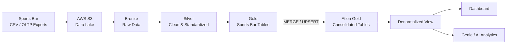
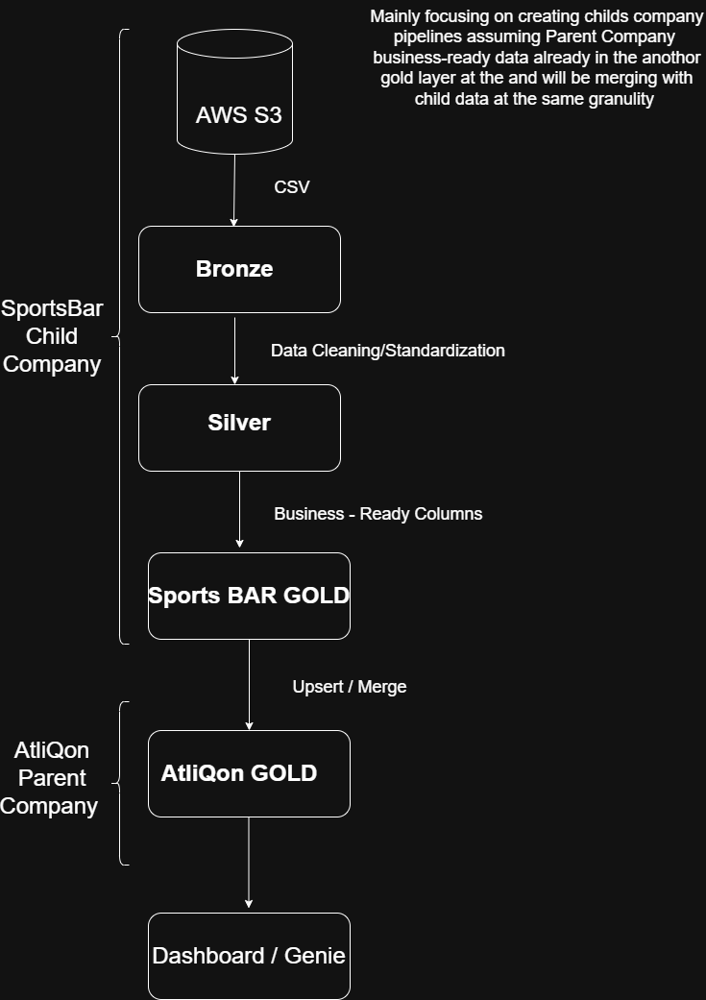

[README_updated.md](https://github.com/user-attachments/files/32871546/README_updated.md)
# 🚀Data Consolidation Pipeline

> **End-to-end Data Engineering project built with Databricks, PySpark, Delta Lake and AWS S3**

This project simulates the integration of **Sports Bar**, an acquired energy-bar company, into the existing analytics platform of its parent company, **Atlon**.

The goal is to transform raw operational CSV data into a reliable **Bronze → Silver → Gold** data platform that can support BI dashboards and natural-language analytics.

---

## 📌 Project at a Glance

| | |
|---|---|
| 🏢 **Business case** | Post-acquisition data consolidation |
| ☁️ **Cloud storage** | AWS S3 |
| ⚙️ **Processing** | Databricks + PySpark |
| 🗄️ **Storage format** | Delta Lake |
| 🏗️ **Architecture** | Medallion Architecture |
| 📊 **Data model** | Star Schema |
| 🔄 **Loading** | Full + Incremental |
| 🤖 **Analytics** | Databricks Dashboards + Genie |

---

## 🎯 Business Problem

Atlon already has a mature OLAP platform based on **Bronze / Silver / Gold** layers.

After acquiring Sports Bar, the company needs to integrate Sports Bar's data into the existing analytics environment.

The challenge is that the two companies have:

- different column names
- different data formats
- inconsistent data quality
- different levels of data granularity
- missing or unreliable values
- different business rules

The pipeline therefore has to provide a unified and scalable data layer for analytics.

### Business requirements

**Reliable** → consolidated analytics in a single dashboard

**Easy to adopt** → understandable and maintainable pipeline structure

**Scalable** → capable of supporting the transition period while the source systems are being migrated

---

# 🏗️ Architecture






### Medallion flow

| Layer | Purpose |
|---|---|
| 🥉 **Bronze** | Raw ingestion + metadata for lineage and debugging |
| 🥈 **Silver** | Cleaning, validation, standardization and business rules |
| 🥇 **Gold** | Business-ready dimensions and fact tables |

---

## 🔄 Processing Strategy

### Historical Backfill

Sports Bar historical data from **July 1 to November 30, 2025** is loaded through a full-load process.

### Incremental Processing

From **December 1, 2025**, daily order files are processed incrementally using staging tables and Delta upserts.

### Consolidation

Sports Bar's child tables are created first and then merged into the existing Atlon Gold layer.

---

# 🛠️ Tech Stack

| Technology | Usage |
|---|---|
| **Databricks Free Edition** | Data engineering platform |
| **PySpark** | Data transformation |
| **Python** | Pipeline logic |
| **SQL** | Data analysis and transformations |
| **AWS S3** | Source data lake |
| **Delta Lake** | ACID tables, MERGE, Time Travel, CDF |
| **Databricks Jobs** | Pipeline orchestration |
| **Databricks Dashboards** | BI / visualization |
| **Genie** | Natural-language analytics |

---

# 🧱 Data Model

The consolidated Gold layer follows a **star schema**.

### Dimensions

- `dim_customers`
- `dim_products`
- `dim_gross_price`
- `dim_date`

### Fact

- `fact_orders`

Sports Bar-specific tables use the `sb_` prefix before consolidation:

```text
sb_dim_customers
sb_dim_products
sb_dim_gross_price
sb_fact_orders
```

---

## 🔀 Schema Alignment

One of the key data-engineering challenges was aligning the different schemas of Atlon and Sports Bar.

| Atlon | Sports Bar | Transformation |
|---|---|---|
| `customer_code` | `customer_id` | Rename + standardize |
| `customer` | `customer_name` + `city` | Build `name-city` |
| `market` | Not available | Add business-approved value |
| `platform` | Not available | Add business-approved value |
| `channel` | Not available | Add business-approved value |
| `product_code` | `product_id` | Mapping / surrogate key |
| Monthly fact | Daily fact | Aggregate before merge |
| Yearly price | Monthly price | Select latest month |

---

# 🧹 Data Quality

The Silver layer applies several data-quality rules.

### Customers

- Remove duplicate customer IDs
- Trim whitespace
- Standardize casing
- Correct city spelling
- Validate cities against an allowed-value list
- Fill missing cities using a business-confirmed lookup
- Cast customer IDs to string

### Products

- Remove duplicates
- Standardize casing
- Correct known typos
- Map categories to divisions
- Extract product variants using regular expressions
- Generate surrogate product codes where source IDs are unreliable

### Gross Price

- Handle multiple date formats
- Convert negative prices
- Replace unknown prices with `0`
- Select the latest monthly price for each product/year

### Orders

- Remove null quantities
- Clean weekday text from dates
- Handle invalid customer IDs
- Remove duplicates

---

# 📥 Full Load vs Incremental Load

```text
Historical Data
      │
      ▼
Full Load
      │
      ▼
Bronze → Silver → Gold
```

```text
New Daily Files
      │
      ▼
Incremental Load
      │
      ▼
Bronze + Staging
      │
      ▼
Silver
      │
      ▼
Gold
      │
      ▼
MERGE / UPSERT
```

The incremental pipeline allows only new data to be processed instead of rebuilding the complete dataset.

---

# ⚙️ Orchestration

The Databricks Job follows dependency order:

```text
Customers
    ↓
Products
    ↓
Gross Price
    ↓
Orders / Incremental Load
```

The pipeline can be scheduled using a daily cron schedule and configured for success/failure notifications.

---

# 📂 Repository Structure

```text
SportsBar/
│
├── README.md
│
├── notebooks/
│   ├── 01_setup_catalog.py
│   ├── 02_utilities.py
│   ├── 03_dim_date_table_creation.py
│   ├── 04_customer_data_processing.py
│   ├── 05_products_data_processing.py
│   ├── 06_pricing_data_processing.py
│   ├── 07_full_load.py
│   └── 08_incremental_load_fact.py
│
└── docs/
    ├── architecture.png
    ├── jobs_dag.png
    └── dashboard.png
```

---

# 🧠 Data Engineering Concepts Demonstrated

- Medallion Architecture
- Star Schema
- Batch / Full Load
- Incremental Data Processing
- Delta Lake
- Delta `MERGE`
- Upsert
- Staging Tables
- Change Data Feed
- Data Lineage
- Schema Alignment
- Surrogate Keys
- Window Functions
- Regular Expressions
- Data Quality
- Databricks Widgets
- Parameterized Notebooks
- Job Orchestration
- Dependency Management

---

# ▶️ How to Run

1. Create a Databricks Free Edition workspace.
2. Create an AWS S3 bucket and upload the source CSV files.
3. Configure the external connection from Databricks to S3.
4. Import the notebooks while keeping the repository structure.
5. Update the S3 path and required configuration values.
6. Run the notebooks in the following order:

```text
1. setup_catalog
2. dim_date_table_creation
3. Parent / Atlon Gold tables
4. Customer processing
5. Product processing
6. Pricing processing
7. Full fact load
8. Incremental fact load
```

9. Create the denormalized analytics view.
10. Build the dashboard / Genie layer.

---

# 🔐 Security

> ⚠️ **Never commit AWS credentials, access keys, secrets or Databricks tokens to GitHub.**

Use environment variables, Databricks secrets or another secure credential mechanism instead.

---

# 📚 Project Background

This project is based on the Databricks data-engineering tutorial by **Codebasics**.

The implementation, notes and documentation in this repository represent my own work and learning process.

**Tutorial source:** https://www.youtube.com/watch?v=U6ZUKWdfSLY&t=3282s

---

# 💡 What I Learned

- Designing a complete Bronze → Silver → Gold pipeline
- Handling schema differences between two business systems
- Building reusable parameterized Databricks notebooks
- Implementing incremental processing with Delta Lake
- Using `MERGE` for upsert operations
- Applying business rules during data cleansing
- Working with fact and dimension tables
- Thinking about data quality, lineage and maintainability

---

## 👤 Author

**Kerem**

[LinkedIn](https://www.linkedin.com/in/recep-kerem-akb%C4%B1y%C4%B1k-)
